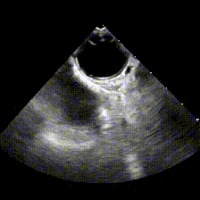
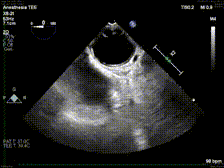

<p align="center">
  
  <!--  -->
</p>

# Phantom: DICOM Anonymization
Phantom is a simple python module intended to simplify medical DICOM anonymization for medical machine-learning applications. Please keep in mind that we do NOT guarantee IRB-validated outputs and are not liable for any breaches of patient privacy.

## Installation
```bash
git clone https://github.com/cyrilzakka/Phantom.git
cd Phantom
```
Phantom relies on a few dependencies to run:
```bash
pip install -r requirements.txt
```

## Sample Usage
Some medical imaging modalities contain a temporal dimension which can be easily leveraged to remove burned annotations. To quickly remove them run:
```bash
python pixel/temporal_mask.py -s /path/to/dicoms -d /path/to/destination
```
<p align="center">
  
  
</p>

## Disclaimer
This project is still in the alpha phase of development and is likely to experience some breaking changes as a result. If you run into any errors, please make sure to update the package first before opening an issue.

## Issues
If you have an issues, feature requests, or simply want to contribute, please do not hesitate to submit a pull request.